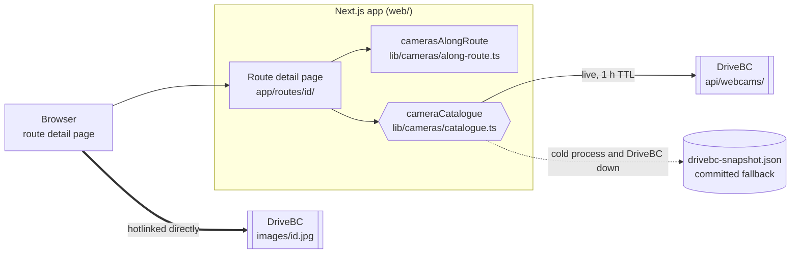

# Route Cameras — Design & Implementation

Design document for the traffic-camera feature (see [specification.md](../specification.md)), building directly on [add-route-design.md](add-route-design.md).

> **Cameras along a route**
> - once a route is confirmed, show the current DriveBC highway camera images along it, in travel order

## 1. Overview

`confirmed` was a dead end. [add-route-design.md](add-route-design.md) took a route as far as a persisted polyline and a static map thumbnail, and there the flow stopped: the route list dropped its Resume action and offered nothing in its place, and there was no route detail page at all. This feature makes `confirmed` a destination — a page that answers the question the whole flow was building toward, *what does the road actually look like right now?*

The shape of the change is small on purpose:

| Piece | What it is |
|---|---|
| `cameraCatalogue` | A fourth swap-point singleton, handing out DriveBC's ~1060 cameras |
| `camerasAlongRoute` | A pure function: polyline + catalogue → an ordered `RouteCamera[]` |
| `/routes/[id]` | A new server-rendered detail page composing `RouteMap` with a camera grid |

**No new DB column, no schema change, no new npm dependency.** §8 of the add-route design names the second schema change as the trigger for adopting migration tooling; this feature deliberately does not spend that trigger (§4).

## 2. Data source — measured, not assumed

The catalogue was originally taken as a CSV export of the [BC HighwayCams open-data set](https://catalogue.data.gov.bc.ca/dataset/bc-highwaycams), saved at `bc-cameras/webcams.csv`. Ten random ids were checked against both candidate image URLs on 2026-09-08:

| URL form | Result over 10 random ids |
|---|---|
| `https://www.drivebc.ca/images/{id}.jpg` | **10/10 → 200 `image/jpeg`**, 34–92 KB, ten distinct MD5s, `FFD8` magic |
| `https://images.drivebc.ca/bchighwaycam/pub/cameras/{id}.jpg` — the CSV's own `links_imageDisplay` | 200, but **`image/png`, exactly 40571 bytes, one identical MD5 for all ten** |

The CSV's URLs are not merely broken — they answer **200** with a placeholder, so adopting them would have rendered a wall of identical "unavailable" tiles with no error for the UI to catch. This is the single most important fact in this document, and `test/httpYac/drivebc-cameras.http` records it as a live request so nobody re-adopts those URLs.

Two further findings moved the design off the CSV entirely:

- **A live JSON API exists**: `https://www.drivebc.ca/api/webcams/` returns a bare array of **1062** cameras, **113 KB gzipped** (~1.2 MB parsed), in **~190 ms**, with a weak ETag. It carries GeoJSON `location`, liveness flags, `last_update_modified`, `update_period_mean` (~928 s, so pictures change about every 15 min), and `group`.
- **The CSV was already stale**: 1034 ids against 1062 live. 33 cameras existed only in the API; 5 existed only in the CSV.

### Dark cameras answer 200 — decision

All five CSV-only ids returned **200** with an identical 8883-byte black frame carrying a red `DriveBC.ca` bar. Only ids that never existed 404 (`999999`). Seventeen of the 1062 live cameras are `is_on: false` today, and camera 826 — `is_on: false`, `marked_stale: true`, last modified five months ago — behaves the same way.

**Verdict: liveness is read from `is_on` / `marked_stale` in the catalogue, never from the image response.** An `onError` handler is dead code for a dark camera, so `CameraCard` does not request its picture at all (§7). This rule is commented at every place it applies, because "hide it if the image fails" is the obvious thing to write and it does not work here.

### Caching characteristics

Images send `access-control-allow-origin: *`, an `ETag`, and `cache-control: no-cache`, and answer `If-None-Match` with a **304**. That is already the right policy for a 15-minute feed, and it is why the app neither proxies nor re-caches them (§6).

## 3. Architecture

The camera catalogue is a fourth swap point of exactly the shape the add-route design established (§2 there), but gated differently: DriveBC is public, so there is no key whose absence means "use the mock".



The heavy arrow matters: camera pictures never pass through the app. Only the catalogue does, and only server-side.

## 4. Data model

Nothing is persisted. The match is a pure function of polyline and catalogue costing ~15 ms, and `isOn` / `lastUpdated` change every few minutes — storing camera ids would be wrong within the hour and would create an invalidation problem across both re-confirmation and catalogue drift. **This is why there is no schema change, and why the migration-tooling trigger stays unspent.**

`Camera` is the app's own shape, mapped from DriveBC's ~38-field record so a change to any of the rest cannot reach the UI:

```ts
interface Camera {
  id: number; name: string; caption: string;
  highway: string; highwayDescription: string; regionName: string;
  orientation: string;   // displayed, never filtered on
  group: number;         // the site this camera belongs to — see §5.1
  location: GeoPoint;
  isOn: boolean; isStale: boolean; isDelayed: boolean;
  lastUpdated: string | null; updatePeriodSeconds: number | null;
  credit: string; dbcMark: string;
}
interface RouteCamera extends Camera {
  distanceFromRouteMeters: number;   // within the corridor by construction
  distanceAlongRouteMeters: number;  // from the origin
}
interface CameraCatalogue { cameras: Camera[]; fetchedAt: string; origin: "live" | "snapshot" }
```

`CameraCatalogue` carries its own provenance rather than being a bare array, so the UI can disclose when it is showing a saved list.

### Fetch behaviour — decisions

| Decision | Why |
|---|---|
| Per-item `safeParse`, not `z.array(...)` | One malformed record in 1062 must not blank the feature. A `MIN_VALID_FRACTION` of 0.9 is the tripwire that still catches a real schema change |
| Only `id` and `location` required | Everything else defaults, so a renamed field costs a caption rather than the catalogue |
| 1-hour TTL, `cache: "no-store"` on the fetch | We own the TTL. Letting Next's data cache also hold the body would give two caches with different expiries and no way to tell which answered |
| Single in-flight promise | Concurrent cold page loads make one upstream request, not ten |
| Stale-while-error, 60 s backoff | An hour-old live list beats the committed snapshot; the snapshot is a floor, not a peer |
| `should_appear: false` dropped; `is_on: false` **kept** | DriveBC hides the former from its own map. The latter is real information for a driver, rendered as an explicit offline card |

The TTL governs **metadata only** — which cameras exist and whether they are live. Pictures are unaffected, because the browser fetches them straight from DriveBC. The visible cost of an hour is that a camera going dark keeps its live badge until the next refresh.

`drivebc-snapshot.json` (555 KB, 1062 records) holds *raw* DriveBC records trimmed to the fields we read, so it is parsed back through exactly the same schema and mapper as the live feed — there is no second copy of the mapping to keep in step. Regenerate with `node scripts/fetch-camera-snapshot.mjs`.

## 5. Matching

`camerasAlongRoute(polyline, cameras, options)` is pure, synchronous, and does no I/O — the one piece of this feature that could be unit-tested as-is the day the repo grows a test runner.

### Geometry lives in `lib/geo/`, not in `lib/maps/`

`lib/maps/static-map.ts` already had `distanceToSegment`, and it was deliberately **not** reused. It works in Web Mercator pixels, where one pixel is `1/cos(lat)` metres — a 1.33× spread across BC. A fixed pixel threshold is a distance threshold that silently widens as you go north: a "2 km" corridor would be 2.0 km near Vancouver and 2.7 km near Fort Nelson. The metric version also has to return the clamped projection parameter `t`, which is what makes distance-along-path fall out for free. It is a genuinely different function, not a missed reuse.

`lib/geo/distance.ts` and `lib/geo/polyline.ts` are new; `mock-route-planner.ts` dropped its private `haversineMeters` and imports the shared one. `static-map.ts` was left untouched — moving its Mercator helpers would refactor working, latitude-verified code for no gain here.

### Algorithm

1. **Precompute once** — cumulative great-circle lengths (~1700 haversines, ~0.1 ms) and the polyline bbox expanded by the corridor. The longitude pad uses the box's *largest* absolute latitude, because that is where a degree is shortest. Erring wide only admits candidates to an exact test that rejects them; erring narrow drops real matches silently.
2. **Bbox prefilter** — four comparisons per camera. Measured on Burnaby → Squamish: **48 candidates out of 1062**.
3. **Exact nearest point** in a local equirectangular frame **anchored at each camera** — one cosine per camera, exact where the measurement is taken. A single route-wide anchor would be ~10% off at the ends of a Vancouver → Prince George route: a silent, position-dependent threshold.
4. **Order** by `cumulative[i] + t · segmentLength(i)`.
5. **Thin** to `MAX_CAMERAS` (§5.1).

Constants: `CORRIDOR_METERS = 2000`, `MAX_CAMERAS = 40`.

**Complexity.** ~48 candidates × 1700 segments in the measured case. End-to-end through the real code path the match step took **12–17 ms**. The bbox prefilter is required; a spatial grid index is not — revisit only if a full-province route measures over 50 ms.

### 5.1 Thinning — the cap must not leave holes, and must not repeat one junction

Two failure modes, both observed on real data rather than imagined.

**Taking the closest 40 spends every slot in town.** Metro Vancouver has cameras every few hundred metres, so a naive cut would show nothing past Horseshoe Bay on a Sea-to-Sky drive. Fix: cut the route into `limit` equal along-distance stretches and let each contribute its best camera before any contributes a second.

**Bucketing alone still repeats one junction.** DriveBC mounts up to four cameras at a single site — `Capilano - N/E/S/W` are four ids sharing one `group`. Across the catalogue, **895 of 1062 cameras sit in a group with at least one sibling** (167 singletons, 193 pairs, 59 triples, 83 quads). On the first real route tested, plain bucketing spent four slots on Capilano and four on Westview while **dropping the Lonsdale interchange entirely**. Fix: within a stretch, deal by `group` — every distinct site's best view before any site's second.

Ranking within a stretch is *offline last, then nearest to the road*, so a live camera always beats a dark one at the same spot and a parallel-highway false positive loses to something actually on the route.

**Measured — Burnaby → Squamish, a real 1700-point Azure Maps path (78.3 km):**

| Stage | Result |
|---|---|
| Bbox candidates | 48 of 1062 |
| Within 2 km | 46 |
| After thinning | 40, covering **all 22 distinct sites**, km 0.2 → km 70.7, strictly ordered |
| Without the per-site step | 40, but only 20 sites — Capilano ×4, Westview ×4, Lonsdale ×0 |

### 5.2 Edge behaviours, encoded and commented

- A camera past the destination clamps to `t = 1` on the last segment and **is included** — it is on the same road, at the end of the drive. Commented so nobody "fixes" it.
- A self-crossing route reports the nearer pass; the camera appears once.
- Fewer than two points returns `[]`. A confirmed route cannot be in that state (the planner rejects it), but the function does not assume its caller.
- Along-distance is measured on the polyline as great-circle chords, so it runs slightly short of `route.distanceMeters` (78 223 m against Azure's 78 337 m). Different measurements; never presented as the same number.

## 6. Image delivery — hotlink, do not proxy

`/api/routes/[id]/map` proxies for exactly one reason, stated in its own docstring: the URL carries `AZURE_MAPS_KEY`. **That reason does not apply here.** Camera URLs carry no secret and DriveBC sets `access-control-allow-origin: *`.

| Decision | Why |
|---|---|
| Direct hotlink | Proxying would push up to 40 JPEGs per page view through the Node process for nothing, and would break the ETag revalidation unless we reimplemented conditional requests |
| No cache headers of our own | We are not serving the bytes. DriveBC's `no-cache` + `ETag` + 304 is already correct for a 15-minute feed; the map route's `max-age=86400, immutable` would pin a traffic camera for a day |
| `?t=` from `lastUpdated`, not from the clock | Stays put while the picture is unchanged (so a re-render is a memory-cache hit) and changes when it does. Deliberately **not** DriveBC's own `links.imageDisplay`, whose `t` is stamped at API-call time and would churn on every catalogue refresh |
| `<Image unoptimized>`, `next.config.ts` left empty | `unoptimized` bypasses the optimizer, so no `remotePatterns` entry is needed. Enabling the optimizer would be actively *wrong*: its `minimumCacheTTL` defaults to 4 hours with, per the bundled Next 16 docs, "no mechanism to invalidate the cache" — four hours of a picture that changes every fifteen minutes |

**Trap for later:** `web/proxy.ts`'s matcher is `["/routes/:path*", "/api/routes/:path*"]`. Any future camera proxy must live under `/api/routes/[id]/...` or it will be unauthenticated.

## 7. UI

`/routes/[id]` is a server component: `auth()` → `routeRepository.get(userId, id)` → `notFound()`. Every repository call is user-scoped, so another user's route id is indistinguishable from a missing one, which is the right thing to disclose.

The camera section is an async child inside `<Suspense>`, so the header and map paint immediately and a slow or unreachable DriveBC costs a spinner in one panel rather than the whole page. Matching runs server-side because the catalogue is a thousand cameras and the answer is forty — the client receives only the matches.

Cards carry an ordinal + along-distance chip (`1 · km 12.4`), which is what makes the page read as a drive rather than a gallery, plus name, caption, highway and orientation chips, off-route distance, relative age, and attribution.

| State | Render |
|---|---|
| `!isOn` | Muted "Camera offline" box; **the image is never requested** (§2) |
| `isStale`/`isDelayed`, or older than 2× its own update period | Image plus an amber badge — derived as well as trusted, because DriveBC's flag lags |
| `onError` | The same placeholder, per the existing "every caller still works without a picture" rule |
| No timestamp | Age line omitted; never "Invalid Date" |
| Route not confirmed | "Cameras appear once the route is confirmed" — reachable by URL or a stale bookmark |
| Corridor empty | "No DriveBC cameras within 2 km of this route" — a correct answer for a rural route, phrased so it does not read as an error |
| Snapshot in use | Amber note naming the snapshot date, and saying the pictures are still live |
| Catalogue unavailable entirely | "Camera information is unavailable right now" |

The page never 500s on a camera failure: the source contracts not to throw, and the page wraps the call anyway.

Relative timestamps come from `useNow()` (`components/use-now.ts`), which returns `null` on the server and the real clock after mount — a relative time rendered server-side would bake the server's clock into HTML the browser then hydrates against a different one. One shared interval serves the whole page, so forty cards keep one timer and agree on what "now" means.

Entry point: a **Cameras** link on confirmed rows in the route list. The name text is deliberately not linked — Rename swaps that cell into an input, and a link there would fight the edit affordance.

## 8. Phasing & implementation checklist

### Phase 1 — geometry ✅
- [x] `lib/geo/distance.ts`, `lib/geo/polyline.ts`
- [x] `mock-route-planner.ts` uses the shared haversine

### Phase 2 — catalogue ✅
- [x] `test/httpYac/drivebc-cameras.http` written **first**, recording both traps as live requests
- [x] types, `CameraSource`, DriveBC source, snapshot source + generator, singleton, `image-url.ts`
- [x] `along-route.ts`, including per-site dealing
- [x] `CAMERA_SOURCE` / `DRIVEBC_WEBCAMS_URL` documented in `.env.local.example`

### Phase 3 — the page ✅
- [x] `app/routes/[id]/page.tsx` + `route-cameras.tsx` with the Suspense boundary
- [x] `camera-card.tsx`, `camera-grid.tsx` + skeleton, `use-now.ts`
- [x] `lib/routes/format.ts` extracted from `route-list.tsx`; Cameras link added

### Phase 4 — refresh (not built, ship separately)
- [ ] `GET /api/routes/[id]/cameras` (`private, no-store`; 409 when unconfirmed)
- [ ] Rate-limited Refresh button, so a page left open can pick up new frames without a reload

### Verification

There is still no test framework, and CI runs only `npm ci` + `npm run build`; everything below was hand-run, which is how this repo has always worked. **A test runner was deliberately not added as a side effect of this feature.**

- `npx tsc --noEmit`, `npx eslint .`, `npm run build` — clean.
- The matcher exercised end-to-end through the real code path against a live 1700-point Azure Maps route: 40 cameras, 22 sites, monotonic, plan 686 ms / catalogue 151 ms cold / **match 17 ms**; catalogue 0 ms warm.
- All three catalogue paths: live (`origin: "live"`), automatic fallback with DriveBC pointed at a dead host (warning logged, `origin: "snapshot"`, same 40 matches), and `CAMERA_SOURCE=snapshot`.
- Server-rendered HTML checked: 40 image srcs each carrying `?t=`, 40 ordinal chips, attribution present; a sampled emitted URL returned a live 61 KB Highway 1 frame.
- Auth gate: `/routes/<id>` unauthenticated → 307 to `/sign-in?callbackUrl=…`.
- **Not yet done:** the page has not been viewed in a browser with a real Entra session. Layout and interaction are unverified.

## 9. Open questions & risks

1. **Terms of use — two instruments, and the images fall between them.** There is no standalone drivebc.ca terms page; the site's footer delegates to province-wide policies. What applies:

   | Covers | Instrument |
   |---|---|
   | The camera **metadata** (ids, coordinates, names, captions) | [DriveBC HighwayCams](https://catalogue.data.gov.bc.ca/dataset/bc-highwaycams), licensed [Open Government Licence – British Columbia](https://www2.gov.bc.ca/gov/content/data/policy-standards/data-policies/open-data/open-government-licence-bc) |
   | The drivebc.ca **website and its material** | [Copyright](https://www2.gov.bc.ca/gov/content/home/copyright), [Disclaimer](https://www2.gov.bc.ca/gov/content/home/disclaimer), [Privacy](https://www2.gov.bc.ca/gov/content/home/privacy) |

   The metadata side is unambiguous and permissive: OGL-BC allows use "in any medium, mode or format for any lawful purpose", requiring only attribution. The website side is restrictive by default — "may not be reproduced or redistributed without the prior written permission of the Province of British Columbia", with a Copyright Permission Request Form for exceptions.

   **The open question is which one governs the JPEG itself.** The dataset publishes the camera records; the pictures are served from the website. Since we hotlink rather than copy or redistribute — the viewer's browser fetches from drivebc.ca directly, and no image byte passes through or is stored by this app — the restrictive clause arguably is not engaged at all. That is the reading this design assumes, and it is the reason §6's no-proxy decision is a licensing safeguard as well as a performance one: **proxying would make us the redistributor.** If that reading is ever rejected, the answer is not to add a proxy but to embed by link only, or seek written permission.

   **Actionable now:** OGL-BC §"You must" requires a specific attribution statement, and where the provider names none, mandates verbatim: *"Contains information licensed under the Open Government Licence – British Columbia."* The current page footer reads "Camera images © Province of British Columbia, via DriveBC.ca", which credits correctly but is not the licence's wording. Carry both.

   Hotlinking also means the viewer's IP reaches drivebc.ca — normal for embedded public-agency imagery, but it is a disclosure, not nothing.
2. **2 km and 40 are starting values.** The corridor already borrows a parallel highway's cameras: on Burnaby → Squamish it pulls in `LGB North End`, `Marine Drive` and `Taylor Way` at ~1.1 km off, which are on the Lions Gate approach, not on the driven route. Since `orientation` filtering was ruled out, the corridor is the only lever. The cheap mitigation, flagged but not built: prefer cameras whose `highway` matches the highways already dominant in the match set.
3. **The `Brunette` camera at km 0.2, 1419 m off** is the same phenomenon at the origin, where a route start near an interchange picks up a neighbouring road. Harmless but visible as the first card.
4. **One-hour TTL against 15-minute images.** Metadata lag only (§4). Kept as a single named constant so 15 minutes is one edit away.
5. **The snapshot will rot.** Regenerated by hand; only reachable when DriveBC is unreachable *and* the process is cold; disclosed in the UI when in use. A scheduled Action that opens a regeneration PR is the obvious upgrade if this outlives the POC.
6. **`camerasAlongRoute` is pure and deterministic — exactly the shape a unit test wants — and there is no runner.** It is the first thing to test the day one lands.
7. **Multi-instance scale-out** would give each instance its own hourly fetch. Trivial at 113 KB; a shared cache only matters if the app scales out meaningfully.
8. **A future `route_cameras` table is still the migration-tooling trigger.** This feature avoids it. When the .NET image-analysis service from specification.md needs to persist per-route scoring, adopt migration tooling *first*, in its own PR, as add-route-design.md §8 specifies.
9. **`bc-cameras/` is untracked and now obsolete** — dead image URLs, 33 cameras short. Recommend deleting it now that the snapshot is committed, so nobody rediscovers it as a data source.
